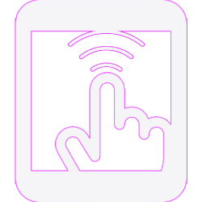

  

<h1 align="center">Taptiva</h1>

  <strong>Remote control for your Mac, from your phone.</strong>

  Taptiva turns your phone into a powerful remote control for your Mac.

  <a href="https://taptiva.tech/download/">
    <strong>Download Taptiva 1.0 — Free</strong>
  </a>

  Free · No account required · macOS

---

## What is Taptiva?

Taptiva turns your phone into a remote control for your Mac.

Control your Mac from your phone with trackpad gestures, keyboard input, music controls and app switching.

No account is required.

---

## Features

### 🖱 Trackpad

Use your phone as a wireless trackpad with intuitive gestures.

### ⌨️ Keyboard

Type on your Mac directly from your phone.

### 🎵 Music Control

Control music and playback remotely from your phone.

### 🔄 App Switcher

Quickly switch between applications running on your Mac.

---

## How it works

1. Install Taptiva on your Mac.
2. Open Taptiva and display the connection QR code.
3. Scan the QR code with your iPhone or Android phone.
4. Start controlling your Mac.

Your phone and Mac should be connected to the same Wi-Fi network.

---

## Accessibility Permission

Taptiva requires macOS Accessibility permission to control your Mac.

If macOS asks for permission, go to:

**System Settings → Privacy & Security → Accessibility**

Find **Taptiva** and enable it.

This permission is required for features such as:

- Mouse and trackpad control
- Keyboard input
- App switching

---

## Privacy

Taptiva is designed around a direct connection between your phone and Mac.

No cloud account is required to connect and use Taptiva.

For more information, see our [Privacy Policy](privacy.html).

---

## Download

### Taptiva 1.0

[**Download Taptiva 1.0 — Free**](https://taptiva.tech/download/)

No account required.

---

## Support Taptiva

Taptiva is an independent project and is currently free.

If you find Taptiva useful, you can support its development:

[☕ **Support Taptiva on Ko-fi**](https://ko-fi.com/taptiva)

Every contribution helps with development, testing and future updates.

---

## Need Help?

If you encounter a problem or have a suggestion, please open an issue in this repository.

You can also contact:

**support@taptiva.tech**

---

## Requirements

- macOS
- iPhone or Android phone
- Mac and phone connected to the same Wi-Fi network
- Accessibility permission enabled for Taptiva

---

## Version

**Taptiva 1.0**

---

  © 2026 Taptiva. All rights reserved.

